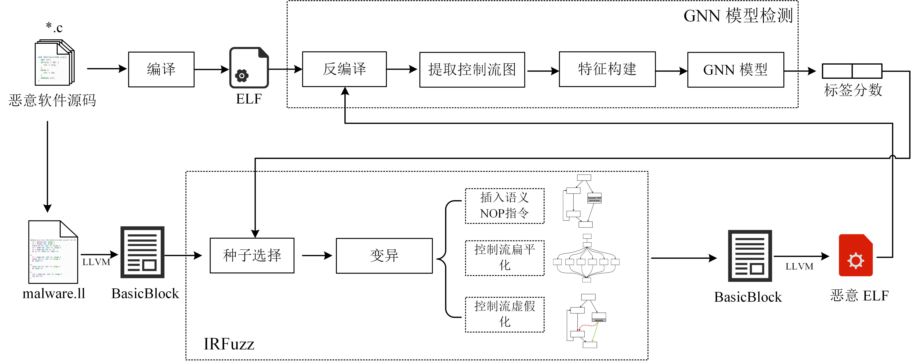

# IRAttack-基于控制流变化的恶意程序检测GNN模型对抗样本生成方法

## 内容摘要：

通过变换中间语言改变二进制程序控制流图的对抗攻击框架IRAttack，能够针对基于控制流图的图神经网络检测模型高效地产生对抗样本。本文通过3种修改中间语言的操作：插入语义NOP指令、控制流扁平化、控制流虚假化，改变对二进制程序进行特征提取后产生出的控制流图的节点特征和结构特征。同时，结合模糊测试思想选择需要修改的位置和添加的内容，从而更高效地产生可以误导检测模型的样本。本文在5472个良性样本和5230个恶意样本上，使用两种不同的特征提取方式和三种模型架构进行两两组合，训练了6种模型作为攻击目标。实验结果显示，IRAttack的平均攻击成功率相较于同背景下的SRLAttack与IMalerAttack，分别提升了46.39%、62.69%。



[文章链接](http://netinfo-security.org/CN/10.3969/j.issn.1671-1122.2024.12.008 "http://netinfo-security.org/CN/10.3969/j.issn.1671-1122.2024.12.008")：http://netinfo-security.org/CN/10.3969/j.issn.1671-1122.2024.12.008

## 实验：

实验脚本详见 [experiment_script.md](https://github.com/laobameishijia/IRattack/blob/main/experiment_script.md)

docker镜像的文件结构：

```
.
├── download_gecko_and_mono.sh 	# 不知道干吗的
├── host 			# 不知道干吗的
├── IRattack 			# 源码
│   ├── build			# LLVM Pass的构建文件
│   ├── CMakeLists.txt
│   ├── include			# 控制流变化的CPP --LLVM Pass
│   ├── log
│   ├── py			# GNN模型以及对抗攻击部分
│   ├── README.md
│   ├── requirements.txt
│   ├── src			# 控制流变化的CPP
│   └── test
├── IRFuzz
│   ├── attack_success_mutation_GIN0_20.json
│   ├── attack_success_mutation_GIN0_9.json
│   ├── attack_success_object.txt
│   ├── attack_success_rate.txt
│   ├── bash			# 使用的脚本命令
│   ├── ELF			# 搜集到的程序源码（只有恶意）
│   └── log
├── log
├── pulse
│   └── client.conf
└── start_notebook.sh

```

## UI部分代码

在ui分支上，使用electron和vue搭建的简单的桌面应用

## 参考：

[1] Wu B， Xu Y， Zou F. [Malware classification by learning semantic and structural features of control flow graphs](https://ieeexplore.ieee.org/document/9724385)[C]// IEEE. 20th International Conference on Trust， Security and Privacy in Computing and Communications (TrustCom)， October 20-22， Shenyang， China. NewYork: IEEE， 2021: 540-547.

[2] [https://github.com/veritas501/ToyObfuscator]([https://github.com/veritas501/ToyObfuscator]())

[3] Rokon M O F， Islam R， Darki A， et al. [SourceFinder: Finding malware Source-Code from publicly available repositories in GitHub](https://www.usenix.org/conference/raid2020/presentation/omar)[C]//USENIX. 23rd International Symposium on Research in Attacks， Intrusions and Defenses (RAID 2020)， October 14-16， Donostia/San Sebastian， Spain. NewYork: USENIX Association 2020: 149-163.
